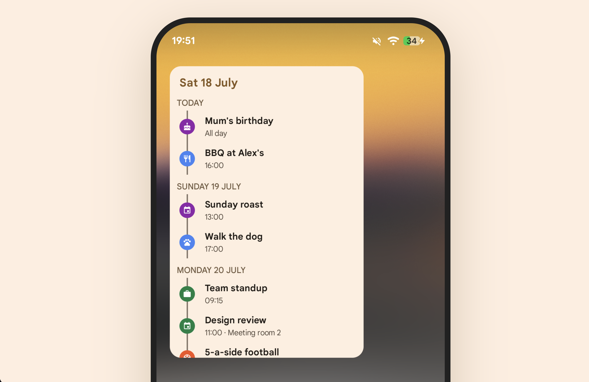

# Calendar Agenda Widget

A simple calendar agenda widget for Android. A glanceable timeline of your upcoming events, pulled in from your calendar(s).

It's a remake of an older agenda widget I used for years that's not supported on Android 17+.

The architecture here is complete overkill for a widget app. But I wanted to add in patterns and tooling I went for on bigger projects. Multi-module structure, convention plugins, static analysis, baseline profiles, CI, automated releases, etc.

- Kotlin, Jetpack Compose, and Glance for the widget itself
- Modularised into `app`, `widget`, `feature:*`, and `core:*` modules with convention plugins in `build-logic`
- Hilt for DI, DataStore for preferences, WorkManager for background refresh
- Detekt, ktlint (via Spotless), Konsist, and dependency guard
- Kover for coverage, baseline profiles for startup performance
- GitHub Actions CI with Renovate and release-please handling dependencies and versioning

## Download

APK from the [latest release](https://github.com/DRonayne/CalendarWidget/releases/latest).
